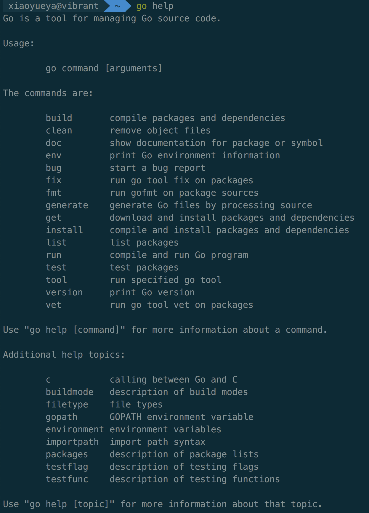

## 标准命令概述
~~~
    Go语言中包含了大量用于处理Go语言代码的命令和工具。其中，go命令就是最常用的一个，它有许多子命令。
~~~


## 一、comman 标准命令
> build：用于编译给定的代码包或Go语言源码文件及其依赖包。

> clean：用于清除执行其他go命令后遗留的目录和文件。

> env：用于打印Go语言环境信息。

> fix：用于执行gotoolfix命令以修正给定代码包的源码文件中包含的过时语法和代码调用。

> fmt：用于执行gofmt命令以格式化给定代码包中的源码文件。

> get：用于下载和安装给定代码包及其依赖包。

> install：用于编译和安装给定的代码包及其依赖包。

> list：用于显示给定代码包的信息

> run：用于编译并运行给定的命令源码文件。

> test：用于测试给定的代码包。

> tool：用于运行Go语言的特殊工具。

> version：用于显示当前安装的Go语言的版本信息。

## 二、通用的额外标记定制命令

> -a：用于强行重新构建所有涉及的Go语言代码包（包括Go语言标准库中的代码包），即使它们已经是最新的了。

> -n：使命令仅打印在执行期间使用到的所有命令，而不真正执行它们。

> -v：用于打印出命令执行过程中涉及的Go语言代码包的名字。这些代码包一般包括我们给定的目标代码包，有时还会包括该代码包直接或间接依赖的代码包。

> -work：打印出命令执行时生成和使用的临时工作目录的名字，且命令执行完成后不对它进行删除。

> -x：打印出命令执行期间使用到的所有命令。

## 三、go下面一些tool命令
```bash
# 命令
go tool

# --命令，然后挑一些作重要的解释下。
addr2line
asm
cgo
compile
cover
dist
doc
fix
link
nm
objdump
pack
pprof
tour
trace
vet
```
>  fix：可以把给定代码包的所有Go语言源码文件中的旧版本代码修正为新版本。它是我们升级Go语言版本后会使用到的工具。

> vet：用于检查Go语言源码中静态错误的简单工具。我们可以使用它检测一些常见的Go语言代码编写错误。

> pprof：用于以交互的方式访问一些性能概要文件。命令将会分析给定的概要文件，并根据要求提供高可读性的输出信息。这个工具可以分析的概要文件包括CPU概要文件、内存概要文件和程序阻塞概要文件。这些内含Go语言运行时信息的概要文件可以通过标准库代码包runtime和runtime/pprof中的程序来生成。

> cgo：用于帮助Go语言代码使用C语言代码库，以及使Go语言代码可以被C语言代码引用。

**更加详细的命令请参考以下网址:**
[go_command_tutorial](https://github.com/hyper0x/go_command_tutorial)
