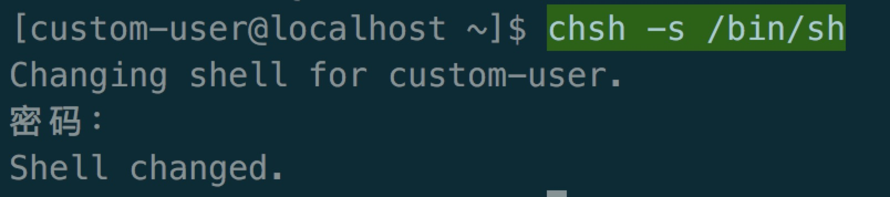
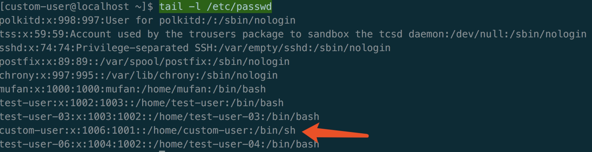

## linux 用户及权限
### 一、查询用户及权限
#### 1. 常用命令
```bash
# 查询当前登陆人
[root@localhost /]# whoami
root

# 查询当前登录人用户组
[root@localhost /]# groups
root

# 查询组下用户
[root@localhost /]# groups kong
kong : kong

# 查询登录人的uid/gid
[root@localhost /]# id
uid=0(root) gid=0(root) 组=0(root)

# 查询其他人的uid/gid
[root@localhost /]# id kong
uid=1008(kong) gid=1008(kong) 组=1008(kong)

# 查询更多组信息
root@localhost /]# more -l /etc/group
root::0:custom-user
bin::1:
daemon::2:
root::0:custom-user

# 查询更多用户信息
[root@localhost /]# less /etc/passwd
root:x:0:0:root:/root:/bin/bash
bin:x:1:1:bin:/bin:/sbin/nologin
daemon:x:2:2:daemon:/sbin:/sbin/nologin
adm:x:3:4:adm:/var/adm:/sbin/nologin
lp:x:4:7:lp:/var/spool/lpd:/sbin/nologin
```

#### 2.用户/组信息存储
> 与用户（user）相关的配置文件；

* /etc/passwd 注：用户（user）的配置文件；
* /etc/shadow 注：用户（user）影子口令文件；

> 与用户组（group）相关的配置文件；

* /etc/group 注：用户组（group）配置文件；
* /etc/gshadow 注：用户组（group）的影子文件；

> 说明

* /etc/group ：/etc/group 文件是用户组的配置文件，内容包括用户和用户组，并且能显示出用户是归属哪个用户组或哪几个用户组，因为一个用户可以归属一个或多个不同的用户组；同一用 户组的用户之间具有相似的特征。比如我们把某一用户加入到root用户组，那么这个用户就可以浏览root用户家目录的文件，如果root用户把某个文件 的读写执行权限开放，root用户组的所有用户都可以修改此文件，如果是可执行的文件（比如脚本），root用户组的用户也是可以执行的；
* 格式：group_name:passwd:GID:user_list，/etc/group 的内容包括用户组（Group）、用户组口令、GID及该用户组所包含的用户（User），每个用户组一条记录；

### 二、组管理
**组数据结构**  
在/etc/group 中的每条记录分四个字段：
+ 第一字段：用户组名称；
+ 第二字段：用户组密码；
+ 第三字段：GID
+ 第四字段：用户列表，每个用户之间用,号分割；本字段可以为空；如果字段为空表示用户组为GID的用户名；

#### 1. 添加用户组
```bash
# 添加用户组 test-group-01
groupadd test-group-01
# 查看刚才创建的用户组信息
tail -n 1 /etc/group

# 其他选项
用法：groupadd [选项] 组

选项:
  -f, --force		如果组已经存在则成功退出
			并且如果 GID 已经存在则取消 -g
  -g, --gid GID                 为新组使用 GID
  -h, --help                    显示此帮助信息并推出
  -K, --key KEY=VALUE           不使用 /etc/login.defs 中的默认值
  -o, --non-unique              允许创建有重复 GID 的组
  -p, --password PASSWORD       为新组使用此加密过的密码
  -r, --system                  创建一个系统账户
  -R, --root CHROOT_DIR         chroot 到的目录
```
#### 2. 删除用户组
```bash
# 删除用户组 test-group-01
groupdel test-group-01

# 其他选项
用法：groupdel [选项] 组

选项:
  -h, --help                    显示此帮助信息并推出
  -R, --root CHROOT_DIR         chroot 到的目录
```
#### 3. 修改用户组信息
```bash
# 修改用户组名称
groupmod -n test-group-02 test-group-01
# 查看修改信息
tail -n 1 /etc/group
# 修改用户组的GID
groupmod -g 1002 test-group-02

# 其他选项
用法：groupmod [选项] 组

选项:
  -g, --gid GID                 将组 ID 改为 GID
  -h, --help                    显示此帮助信息并推出
  -n, --new-name NEW_GROUP      改名为 NEW_GROUP
  -o, --non-unique              允许使用重复的 GID
  -p, --password PASSWORD	将密码更改为(加密过的) PASSWORD
  -R, --root CHROOT_DIR         chroot 到的目录
```
#### 4. 通过/etc/group和/etc/gshadow 的文件内容来同步或创建/etc/gshadow ，如果/etc/gshadow 不存在则创建；
```bash
grpck grpconv
```
#### 5. 通过/etc/group 和/etc/gshadow 文件内容来同步或创建/etc/group ，然后删除gshadow文件
```bash
grpunconv
```

### 三、用户管理
**用户数据结构**  
在/etc/passwd 中的每条记录分七个字段：
* 第一字段：用户名称
* 第二字段：用户密码
* 第三字段：UID
* 第四字段：GID
* 第五字段：登入目录
* 第六字段：home目录
* 第七字段：使用的shell执行器。

**用户的角色区分**  
~~~
    用户在系统中是分角色的，在Linux 系统中，由于角色不同，权限和所完成的任务也不同；值得注意的是用户的角色是通过UID和识别的，特别是UID；在系统管理中，系统管理员一定要坚守UID 唯一的特性；
~~~
* root 用户：系统唯一，是真实的，可以登录系统，可以操作系统任何文件和命令，拥有最高权限；
* 虚拟用户：这类用户也被称之为伪用户或假用户，与真实用户区分开来，这类用户不具有登录系统的能力，但却是系统运行不可缺少的用户，比如bin、daemon、adm、ftp、mail等；这类用户都系统自身拥有的，而非后来添加的，当然我们也可以添加虚拟用户；
* 普通真实用户：这类用户能登录系统，但只能操作自己家目录的内容；权限有限；这类用户都是系统管理员自行添加的；

#### 1. 添加用户
~~~
adduser： 会自动为创建的用户指定主目录、系统shell版本，会在创建时输入用户密码。
useradd：需要使用参数选项指定上述基本设置，如果不使用任何参数，则创建的用户无密码、无主目录、没有指定shell版本。
~~~
```bash
# 添加用户 ，会同事创建用户组 useradd 或 adduser
useradd test-user-01
# 添加用户，指定用户组
useradd -g test-group-02 test-user-03 或 useradd -g 1002 test-user-04
# 添加用户，不创建用户主目录
useradd -M test-user-05
# 添加用户，创建一个系统账户
useradd -r test-user-06
# 添加用户，为用户设置密码
passwd custom-user

# 其他选项
用法：useradd [选项] 登录
      useradd -D
      useradd -D [选项]

选项：
  -b, --base-dir BASE_DIR	新账户的主目录的基目录
  -c, --comment COMMENT         新账户的 GECOS 字段
  -d, --home-dir HOME_DIR       新账户的主目录
  -D, --defaults		显示或更改默认的 useradd 配置
  -e, --expiredate EXPIRE_DATE  新账户的过期日期
  -f, --inactive INACTIVE       新账户的密码不活动期
  -g, --gid GROUP		新账户主组的名称或 ID
  -G, --groups GROUPS	新账户的附加组列表
  -h, --help                    显示此帮助信息并推出
  -k, --skel SKEL_DIR	使用此目录作为骨架目录
  -K, --key KEY=VALUE           不使用 /etc/login.defs 中的默认值
  -l, --no-log-init	不要将此用户添加到最近登录和登录失败数据库
  -m, --create-home	创建用户的主目录
  -M, --no-create-home		不创建用户的主目录
  -N, --no-user-group	不创建同名的组
  -o, --non-unique		允许使用重复的 UID 创建用户
  -p, --password PASSWORD		加密后的新账户密码
  -r, --system                  创建一个系统账户
  -R, --root CHROOT_DIR         chroot 到的目录
  -s, --shell SHELL		新账户的登录 shell
  -u, --uid UID			新账户的用户 ID
  -U, --user-group		创建与用户同名的组
  -Z, --selinux-user SEUSER		为 SELinux 用户映射使用指定 SEUSER
```

#### 2. 删除用户
```bash
# 删除用户 test-user-05
userdel test-user-05

#其他选项
用法：userdel [选项] 登录

选项：
  -f, --force                   force some actions that would fail otherwise
                                e.g. removal of user still logged in
                                or files, even if not owned by the user
  -h, --help                    显示此帮助信息并推出
  -r, --remove                  删除主目录和邮件池
  -R, --root CHROOT_DIR         chroot 到的目录
  -Z, --selinux-user            为用户删除所有的 SELinux 用户映射
```
#### 3. 修改用户
```bash
# 修改用户 将test-user-04修改成test-user-05，但是没有修改信箱
usermod -l test-user-05 test-user-04
# 将用户custom-user附加组root
usermod -G root custom-user
# 重新登录查看custom-user分组
groups
#结果：custom-group root
# 锁定用户
usermod -L custom-user
# 解锁用户
usermod -U custom-user


#其他选项
用法：usermod [选项] 登录

选项：
  -c, --comment 注释            GECOS 字段的新值
  -d, --home HOME_DIR           用户的新主目录
  -e, --expiredate EXPIRE_DATE  设定帐户过期的日期为 EXPIRE_DATE
  -f, --inactive INACTIVE       过期 INACTIVE 天数后，设定密码为失效状态
  -g, --gid GROUP               强制使用 GROUP 为新主组
  -G, --groups GROUPS           新的附加组列表 GROUPS
  -a, --append GROUP            将用户追加至上边 -G 中提到的附加组中，                                                   并不从其它组中删除此用户
  -h, --help                    显示此帮助信息并推出
  -l, --login LOGIN             新的登录名称
  -L, --lock                    锁定用户帐号
  -m, --move-home               将家目录内容移至新位置 (仅于 -d 一起使用)
  -o, --non-unique              允许使用重复的(非唯一的) UID
  -p, --password PASSWORD       将加密过的密码 (PASSWORD) 设为新密码
  -R, --root CHROOT_DIR         chroot 到的目录
  -s, --shell SHELL             该用户帐号的新登录 shell
  -u, --uid UID                 用户帐号的新 UID
  -U, --unlock                  解锁用户帐号
  -Z, --selinux-user  SEUSER       用户账户的新 SELinux 用户映射
```

### 四、权限管理
**权限数据结构**
| 权限名称 | 符号 | 权限值 |
| :-- | :-- | :-- |
| read | r | 4 |
| write | w | 2 |
| execute | x | 1 |

> 每种身份（owner/group/others）各自的三个权限（r/w/x）分数是需要累加的，例如当权限为：
1. owner = rwx = 4+2+1 = 7 
2. group = rwx = 4+2+1 = 7 
3. others= --- = 0+0+0 = 0

**符号对应关系表**
| 命令 | 身份 | 设置 | 权限 | 文件夹/文件 |
| :-- | :-- | :-- | :-- | :-- |
| chmod | u（user） | + (加入) | r  (read) | file |
|  | g（group） | -  (除去) | w  (wirte) |  |
|  | o（other） | = (设置) | x  (execute) |  |
|  | a（all） |  |  |  |

#### 1. 查询权限
**ls -l 输出**
> [权限属性信息] [连接数] [拥有者] [拥有者所属用户组] [大小] [最后修改时间] [文件名]

**权限属性列表为10个字符**
+ 第一个字符表示文件类型，
    + d为目录 
    + -为普通文件 
    + l为连接 
    + b为可存储的接口设备 
    + c为键盘鼠标等输入设备
> 2、3、4个字符表示所有者权限，5、6、7个字符表示所有者同组用户权限，8、9、10为其他用户权限**
+ 第二个字符表示所有者读权限，如果有权限则为r，没有权限则为-
+ 第三个字符表示所有者写权限，如果有权限则为w，没有权限则为-
+ 第四个字符表示所有者执行权限，如果有权限则为x，没有权限则为-
+ 第五个字符表示所有者同组用户读权限，如果有权限则为r，没有权限则为-
+ 第六个字符表示所有者同组用户写权限，如果有权限则为w，没有权限则为-
+ 第七个字符表示所有者同组用户执行权限，如果有权限则为x，没有权限则为-
+ 第八个字符表示其他非同组读权限，如果有权限则为r，没有权限则为-
+ 第九个字符表示其他非同组写权限，如果有权限则为w，没有权限则为-
+ 第十个字符表示其他非同组执行权限，如果有权限则为x，没有权限则为-

```bash
[root@localhost kong]# ls -l
总用量 4
-rw-rw-r-- 1 kong kong 13 3月   7 20:59 readme
```

#### 2. 查看可用的shell命令，及修改
```bash
# 查看命令
chsh -l
# 指定登录的 shell,可以通过tail -l /etc/passwd 查看变更结果，如下图
chsh -s /bin/sh

# 其他选项
用法：
 chsh [选项] [用户名]

选项：
 -s, --shell <shell>  指定登录 shell
 -l, --list-shells    打印 shell 列表并退出

 -u, --help     显示此帮助并退出
 -v, --version  输出版本信息并退出
```



#### 3. 查看自己或者默认的UID/GID信息
```bash
# 查看自己的uid和gid
id
# 查看test-user-03的uid和gid
id test-user-03

#其他选项
Usage: id [OPTION]... [USER]
Print user and group information for the specified USER,
or (when USER omitted) for the current user.

  -a             ignore, for compatibility with other versions
  -Z, --context  print only the security context of the current user
  -g, --group    print only the effective group ID
  -G, --groups   print all group IDs
  -n, --name     print a name instead of a number, for -ugG
  -r, --real     print the real ID instead of the effective ID, with -ugG
  -u, --user     print only the effective user ID
  -z, --zero     delimit entries with NUL characters, not whitespace;
                   not permitted in default format
      --help		显示此帮助信息并退出
      --version		显示版本信息并退出

如果不附带任何选项，程序会显示一些可供识别用户身份的有用信息。
```
#### 4. 修改文件所属组命令
```bash
# 修改文件组信息
chgrp custom-group 1.txt

# 其他选项
用法：chgrp [选项]... 用户组 文件...
　或：chgrp [选项]... --reference=参考文件 文件...
Change the group of each FILE to GROUP.
With --reference, change the group of each FILE to that of RFILE.

  -c, --changes          like verbose but report only when a change is made
  -f, --silent, --quiet  suppress most error messages
  -v, --verbose          output a diagnostic for every file processed
      --dereference      affect the referent of each symbolic link (this is
                         the default), rather than the symbolic link itself
  -h, --no-dereference   affect symbolic links instead of any referenced file
                         (useful only on systems that can change the
                         ownership of a symlink)
      --no-preserve-root  do not treat '/' specially (the default)
      --preserve-root    fail to operate recursively on '/'
      --reference=RFILE  use RFILE's group rather than specifying a
                         GROUP value
  -R, --recursive        operate on files and directories recursively

The following options modify how a hierarchy is traversed when the -R
option is also specified.  If more than one is specified, only the final
one takes effect.

  -H                     if a command line argument is a symbolic link
                         to a directory, traverse it
  -L                     traverse every symbolic link to a directory
                         encountered
  -P                     do not traverse any symbolic links (default)

      --help		显示此帮助信息并退出
      --version		显示版本信息并退出

示例：
  chgrp staff /u            将 /u 的属组更改为"staff"。
  chgrp -hR staff /u    将 /u 及其子目录下所有文件的属组更改为"staff"。
```
#### 5. 修改文件所属者和组的命令
```bash
# 修改文件的所属者
chown custom-user 1.txt
# 修改文件所属者及组
chown -R root:root 1.txt

# 其他选项
-R recursive 递归的意思
```

#### 6. 修改文件访问权限命令
```bash
# 使用符号或数字来表述权限

# 给文件执行权限
chmod u+x 3.sh
# 给文件所有权限
chmod 777 2.txt

# 使用符号设置权限
chmod u=rw-,g=rw-,o=--- 2.txt
# 单独设置 user的execute权限
chmod u+x 2.txt
# 单独设置 other的read权限
chmod o+r 2.txt
# 单独去除 other的read权限
chmod o-r 2.txt
# 设置所有身份的read权限
chmod a+r 2.txt
# 删除所有身份的write权限
chmod a-w 2.txt

# 其他选项
用法：chmod [选项]... 模式[,模式]... 文件...
　或：chmod [选项]... 八进制模式 文件...
　或：chmod [选项]... --reference=参考文件 文件...
Change the mode of each FILE to MODE.
With --reference, change the mode of each FILE to that of RFILE.

  -c, --changes          like verbose but report only when a change is made
  -f, --silent, --quiet  suppress most error messages
  -v, --verbose          output a diagnostic for every file processed
      --no-preserve-root  do not treat '/' specially (the default)
      --preserve-root    fail to operate recursively on '/'
      --reference=RFILE  use RFILE's mode instead of MODE values
  -R, --recursive        change files and directories recursively
      --help		显示此帮助信息并退出
      --version		显示版本信息并退出

Each MODE is of the form '[ugoa]*([-+=]([rwxXst]*|[ugo]))+|[-+=][0-7]+'.
```