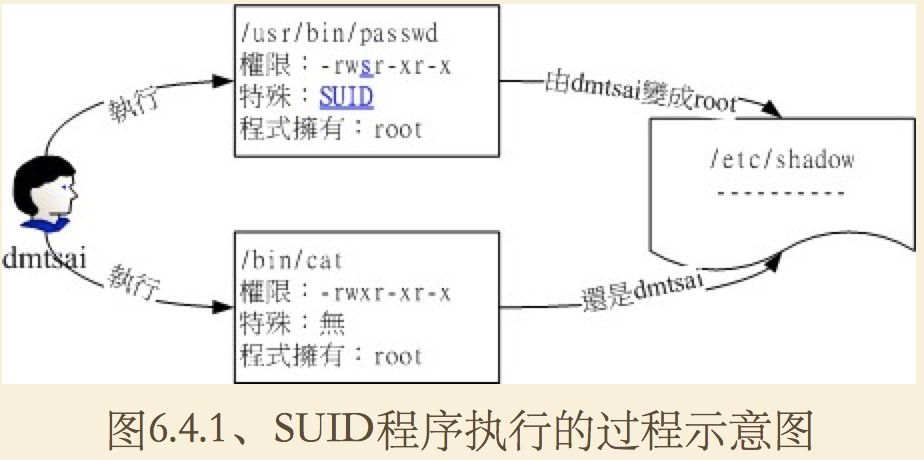

## linux用户及权限补充

~~~ description
我们都知道linux系统是多用户、多任务的操作系统，用户管理和权限管理参考http://2148fa7e.wiz03.com/share/s/0xifF-0vJQcD2FDV9W2F5M9r1aFl-f0ZNQvj2HbV7c277fDm

今天我们将对linux系统原有权限进行补充。
~~~

> r w x -> 4 2 1

### 一、linux系统默认权限

~~~ description
当我们创建用户和文件的时候，没有设置任何权限，但是文件或者用户都已经有了权限，这些权限是从哪里来的呢？可以修改这些默认权限吗？当然是可以的。
~~~

> umask是指定目前用户在创建文件或目录时权限的默认值。

```bash
# 查看权限默认值（与一般权限有关的是后面三个数字）
umask
# 使用键值对的方式显示， user、group、other的权限绑定。-S ( Symbolic )
umask -S
# u=rwx,g=rwx,o=rx
```

### 二、linux 文件隐藏属性

~~~
没错，linux文件系统除了支持9位的普通权限外，还有隐藏属性。不要小看隐藏属性，对于系统的安全（Security）非常重要。
主要是lsattr和chattr两个命令来实现。
~~~

> 注意： chattr命令只能在ext2、ext3、ext4的linux传统文件系统上完整生效。最新的xfs文件系统上仅支持部分命令。  
    属性设置常见的是a和i的设置值，设置该值需要使用root权限才能够设置。  
    xfs 文件系统仅支持 AadiS参数。


```bash
[root@study ~]# chattr [+-=][ASacdistu] 文件或目录名称 
选项与参数： 

+ ：增加某一个特殊参数，其他原本存在参数则不动。 
- ：移除某一个特殊参数，其他原本存在参数则不动。 
= ：设置一定，且仅有后面接的参数 

A ：当设置了 A 这个属性时，若你有存取此文件（或目录）时，他的存取时间 atime 将不会被修改， 可避免 I/O 较慢的机器过度的存取磁盘。（目前建议使用文件系统挂载参数处理这个项目）

S ：一般文件是非同步写入磁盘的（原理请参考前一章sync的说明），如果加上 S 这个属性时， 当你进行任何文件的修改，该更动会“同步”写入磁盘中。 

a ：当设置 a 之后，这个文件将只能增加数据，而不能删除也不能修改数据，只有root 才能设置这属性 

c ：这个属性设置之后，将会自动的将此文件“压缩”，在读取的时候将会自动解压缩， 但是在储存的时候，将会先进行压缩后再储存（看来对于大文件似乎蛮有用的！） 

d ：当 dump 程序被执行的时候，设置 d 属性将可使该文件（或目录）不会被 dump 备份 

i ：这个 i 可就很厉害了！他可以让一个文件“不能被删除、改名、设置链接也无法写入或新增数据！” 对于系统安全性有相当大的助益！只有 root 能设置此属性 

s ：当文件设置了 s 属性时，如果这个文件被删除，他将会被完全的移除出这个硬盘空间， 所以如果误删了，完全无法救回来了喔！ 

u ：与 s 相反的，当使用 u 来设置文件时，如果该文件被删除了，则数据内容其实还存在磁盘中，可以使用来恢复文件。

```
> attr 使用
```bash
# 查看文件隐藏属性
[root@localhost custom-user]# lsattr
---------------- ./1.txt
---------------- ./2.txt
---------------- ./3.sh
---------------- ./tmp

# 设置文件隐藏属性
[root@localhost custom-user]# chattr +a 1.txt
[root@localhost custom-user]# lsattr
-----a---------- ./1.txt
---------------- ./2.txt
---------------- ./3.sh
---------------- ./tmp
```

### 三、文件特殊权限 SUID SGID SBIT
| 权限名称 | 作用范围 | 符号 | 权限制 | 描述 |
| :--- | :--- | :--- | :--- | :--- |
| SET UID | 二进制文件 | s | 4 | 1. SUID 权限仅对二进制程序（binary program）有效；<br> 2. 执行者对于该程序需要具有 x 的可执行权限；<br> 3. 本权限仅在执行该程序的过程中有效 （run-time）； <br> 4. 执行者将具有该程序拥有者 （owner） 的权限。 |
| SET GID | 二进制文件/文件夹 | s | 2 | 文件：<br> 1. SGID 对二进制程序有用；<br>2. 程序执行者对于该程序来说，需具备 x 的权限； <br>3. 执行者在执行的过程中将会获得该程序群组的支持！<br>文件夹：<br>1. 使用者若对于此目录具有 r 与 x 的权限时，该使用者能够进入此目录；<br>2. 使用者在此目录下的有效群组（effective group）将会变成该目录的群组； <br> 3.用途：若使用者在此目录下具有 w 的权限（可以新建文件），则使用者所创建的新文件，该新文件的群组与此目录的群组相同。|
| Sticky Bit | 文件夹 | t | 1 | 1. 当使用者对于此目录具有 w, x 权限，亦即具有写入的权限时； <br>2. 当使用者在该目录下创建文件或目录时，仅有自己与 root 才有权力删除该文件。|

> SUID 执行过程


> 同样支持数字设置和符号设置
```bash
# 数字设置 -- beign --
[root@localhost custom-user]# chmod 4777 3.sh
[root@localhost custom-user]# ll 3.sh
-rwsrwxrwx 1 custom-user custom-group 21 2月  14 16:46 3.sh
# 去除user的s
[root@localhost custom-user]# chmod 0777 3.sh
[root@localhost custom-user]# ll 3.sh
-rwxrwxrwx 1 custom-user custom-group 21 2月  14 16:46 3.sh

# 设置文件夹
[root@localhost custom-user]# mkdir tmp
[root@localhost custom-user]# chmod 1777 tmp
[root@localhost custom-user]# ll
总用量 8
drwxrwxrwt 2 root        root           6 3月   8 03:08 tmp
# 删除文件夹的Sticky Bit
[root@localhost custom-user]# chmod 0777 tmp/
[root@localhost custom-user]# ll
总用量 8
-rw------- 1 root        root           0 2月  14 14:06 1.txt
-r-xr--r-- 1 custom-user custom-group 889 2月  14 16:45 2.txt
-rwxrwxrwx 1 custom-user custom-group  21 2月  14 16:46 3.sh
drwxrwxrwx 2 root        root           6 3月   8 03:08 tmp

# 给没有x权限的文件增加s权限
[root@localhost custom-user]# chmod 4677 3.sh
[root@localhost custom-user]# ll 3.sh
-rwSrwxrwx 1 custom-user custom-group 21 2月  14 16:46 3.sh

############  注意： 这个时候我们发现S变成了大写。这说明s没有生效，也就是说 s和t都是在 x基础之上的权限，无法独立设置。  ############


# 数字设置 -- end --

# 符号设置 -- beign --

# 设置SUID
[root@localhost custom-user]# chmod 777 1.txt
[root@localhost custom-user]# chmod u+s 1.txt
[root@localhost custom-user]# ll 1.txt
-rwsrwxrwx 1 root root 0 2月  14 14:06 1.txt

# 设置SGID
[root@localhost custom-user]# chmod g+s 1.txt
[root@localhost custom-user]# ll 1.txt
-rwsrwsrwx 1 root root 0 2月  14 14:06 1.txt

# 设置Sticky Bit
[root@localhost custom-user]# chmod o+t tmp
[root@localhost custom-user]# ll
总用量 8
-rwsrwsrwx 1 root        root           0 2月  14 14:06 1.txt
-r-xr--r-- 1 custom-user custom-group 889 2月  14 16:45 2.txt
-rwSrwxrwx 1 custom-user custom-group  21 2月  14 16:46 3.sh
drwxrwxrwt 2 root        root           6 3月   8 03:08 tmp

# 符号设置 -- end --
```


