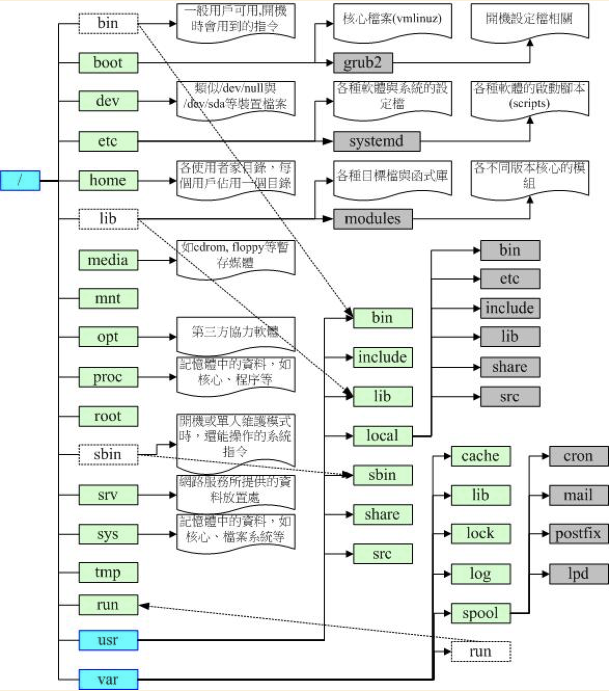

## linux 目录结构概况

### 一、linux “/”为linux根目录，该目录下主要文件夹为：
```bash
[root@localhost custom-user]# cd /
[root@localhost /]# ls
bin   dev  home  lib64  mnt  proc  run   srv  tmp  var
boot  etc  lib   media  opt  root  sbin  sys  usr
```
### 二、linux系统对应用户类型分为两种一种是root用户一种是普通用户


### 三、梳理及说明
