## 使用idea调试lua代码
~~~~
Openresty是基于nginx与lua的高性能web框架，继承了大量的高质量的lua库、第三方模块以及大多数依赖项。
目前对于lua主流开发工具有vscode+lua插件、IntelliJ IDEA+EmmyLua、ZeroBrane Studio、还有其他的一些文本编辑软件等。
lua作为一种脚本语言，除了开发简洁，性能优越之外，还应该具备调试功能，对于开发者才能算得上更加友好。
~~~~
> 本文将使用IntelliJ IDEA+EmmyLua使用远程调试和本地调试。
* IntelliJ IDEA 2018.2.1
* Lua 5.1
* EmmyLua 1.2.6-IDEA182
* [MobDebug 0.70](https://github.com/vibrantbyte/MobDebug)

> 项目目录结构

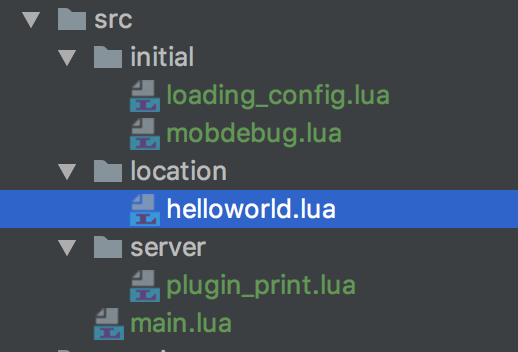

> 源码位置[often-script](https://github.com/vibrantbyte/often-script/tree/master/lua/project)

## 一、远程调试
### 1、打开idea中调试配置，使用Lua Remote(Mobdebug),如下图：
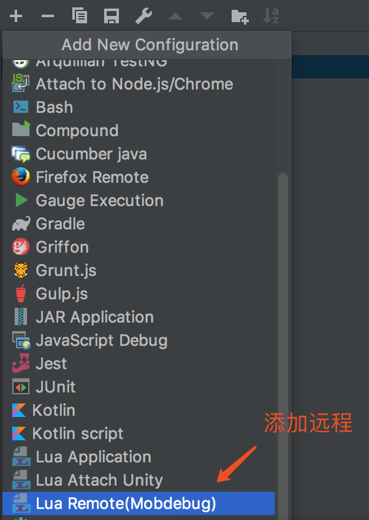

### 2、配置调试名称和远程调试端口；
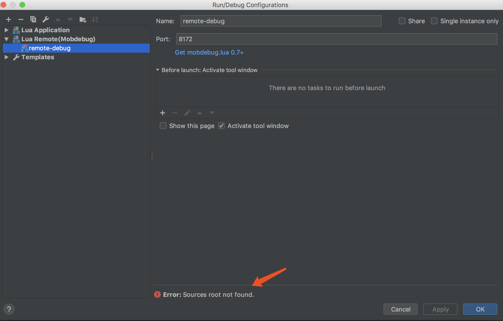

### 3、在需要调试的位置加上调试代码；
~~~lua
--- 启动调试
local mobdebug = require("src.initial.mobdebug");
mobdebug.start();
~~~

### 4、启动Openresty项目，然后打开debug模式；
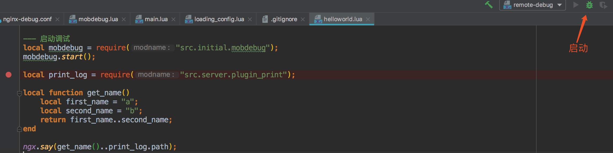

### 5、启动openresty项目；
~~~bash
# 进入到工作目录
cd /Users/xiaoyueya/projects/vscode/often-script/lua/project
# 启动nginx
sudo nginx -p ./ -c nginx-debug.conf -s reload
~~~
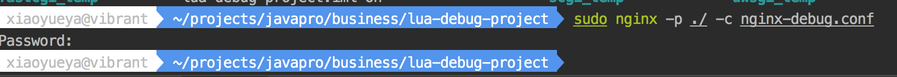

### 6、刷新浏览器；
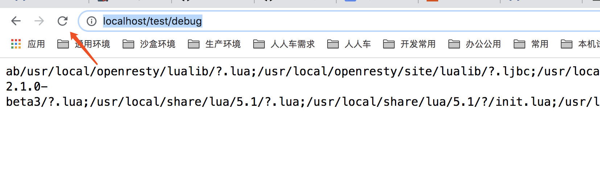

### 7、断点位置和lua栈信息；
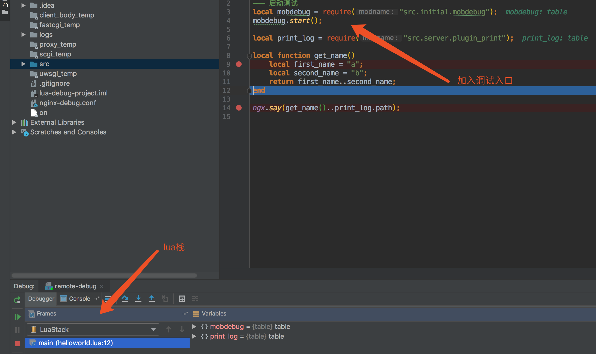

### 8、执行结果；
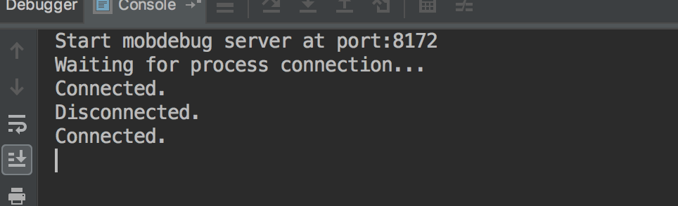

## 二、本地调试
### 1、打开idea中调试配置,使用lua application ，如下图：
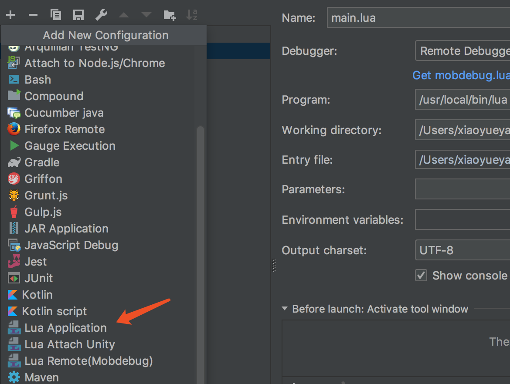

### 2、配置工作目录和执行文件入口；
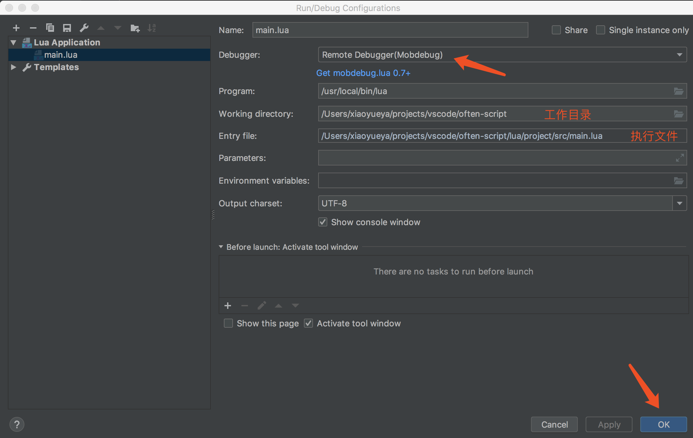

### 3、编写调试名称为main.lua,然后点击OK，进入主编辑页,找到调试按钮；
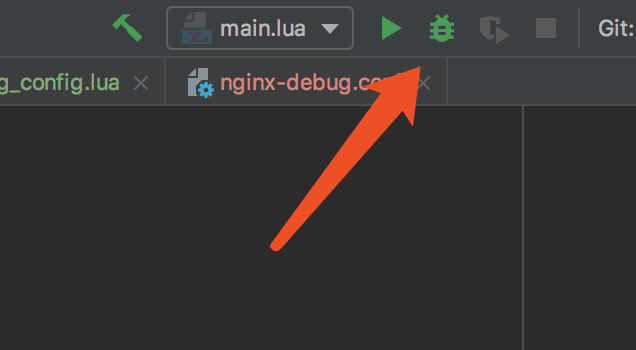

### 4、开始本地调试；
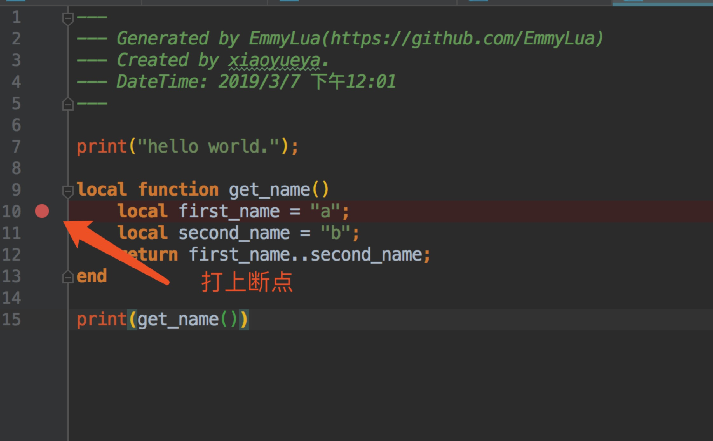

### 5、查看堆栈信息;
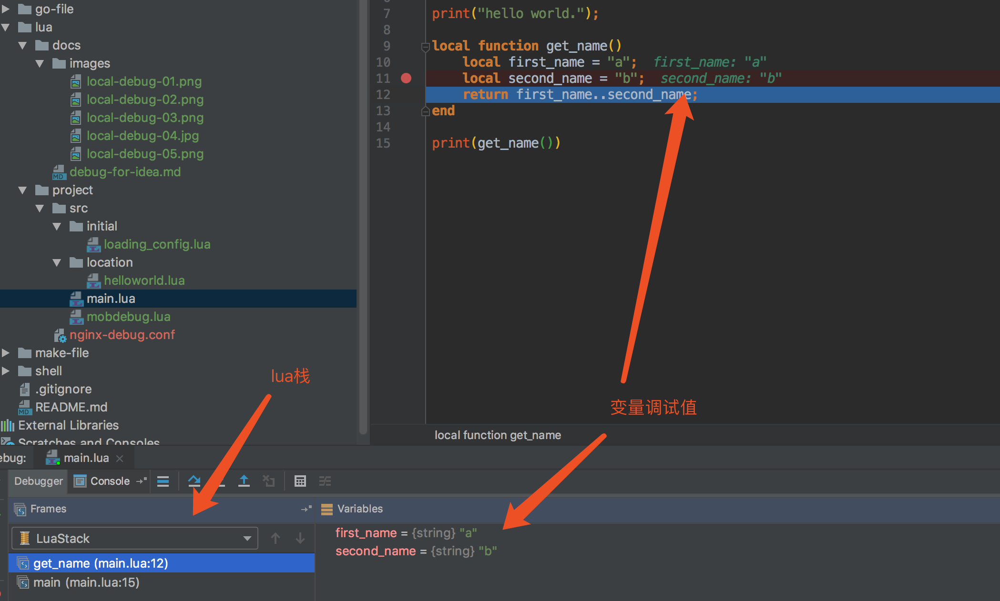

### 6、查看执行结果
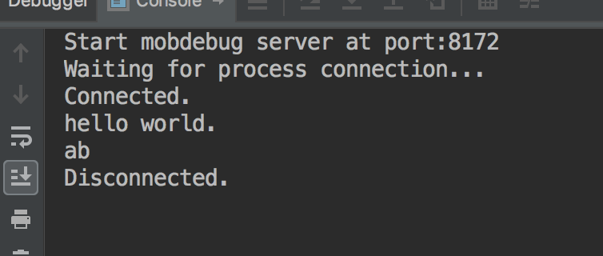

