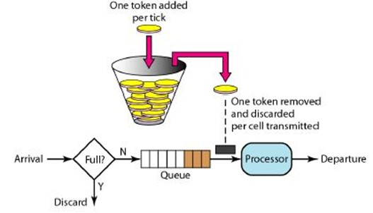

## 网关 rate limit 网络速率限制方案

### 一、网络限流算法
~~~
    在计算机领域中，限流技术（time limiting）被用来控制网络接口收发通讯数据的速率。用这个方法来优化性能、较少延迟和提高带宽等。
    在互联网领域中也借鉴了这个概念，用来控制网络请求的速率，在高并发，大流量的场景中，比如双十一秒杀、抢购、抢票、抢单等场景。
    网络限流主流的算法有两种，分别是漏桶算法和令牌桶算法。接下来我们一一为大家介绍：
~~~
#### 1. 漏桶算法
  

描述：漏桶算法思路很简单，水（数据或者请求）先进入到漏桶里，漏桶以一定的速度出水，当水流入速度过大会直接溢出，可以看出漏桶算法能强行限制数据的传输速率。

> 实现逻辑： 控制数据注入到网络的速率，平滑网络上的突发流量。漏桶算法提供了一种机制，通过它，突发流量可以被整形以便为网络提供一个稳定的流量。 漏桶可以看作是一个带有常量服务时间的单服务器队列，如果漏桶（包缓存）溢出，那么数据包会被丢弃。  

> 优缺点：在某些情况下，漏桶算法不能够有效地使用网络资源。因为漏桶的漏出速率是固定的参数，所以，即使网络中不存在资源冲突（没有发生拥塞），漏桶算法也不能使某一个单独的流突发到端口速率。因此，漏桶算法对于存在突发特性的流量来说缺乏效率。而令牌桶算法则能够满足这些具有突发特性的流量。通常，漏桶算法与令牌桶算法可以结合起来为网络流量提供更大的控制。

#### 2. 令牌桶算法


> 实现逻辑：令牌桶算法的原理是系统会以一个恒定的速度往桶里放入令牌，而如果请求需要被处理，则需要先从桶里获取一个令牌，当桶里没有令牌可取时，则拒绝服务。 令牌桶的另外一个好处是可以方便的改变速度。 一旦需要提高速率，则按需提高放入桶中的令牌的速率。 一般会定时(比如100毫秒)往桶中增加一定数量的令牌， 有些变种算法则实时的计算应该增加的令牌的数量, 比如华为的专利"采用令牌漏桶进行报文限流的方法"(CN 1536815 A),提供了一种动态计算可用令牌数的方法， 相比其它定时增加令牌的方法， 它只在收到一个报文后，计算该报文与前一报文到来的时间间隔内向令牌漏桶内注入的令牌数， 并计算判断桶内的令牌数是否满足传送该报文的要求。


### 二、常见的 Rate limiting 实现方式

#### 1. Nginx 模块 (漏桶)
* 参考地址：[limit_req_module](http://nginx.org/en/docs/http/ngx_http_limit_req_module.html)

> ngx_http_limit_req_module模块(0.7.21)用于限制每个定义键的请求处理速度，特别是来自单个IP地址的请求的处理速度。

##### 1.1 Example Configuration
```nginx
http {
    limit_req_zone $binary_remote_addr zone=one:10m rate=1r/s;

    ...

    server {

        ...

        location /search/ {
            limit_req zone=one burst=5;
        }
```
##### 1.2 使用规则
```nginx
语法:	limit_req zone=name [burst=number] [nodelay | delay=number];
默认:	—
作用范围:	http, server, location
```
**参数说明**
* zone 设置内存名称和内存大小。
* burst 漏桶的突发大小。当大于突发值是请求被延迟。
* nodelay|delay delay参数(1.15.7)指定了过度请求延迟的限制。默认值为零，即所有过量的请求都被延迟。

> 设置共享内存区域和请求的最大突发大小。如果请求速率超过为区域配置的速率，则延迟处理请求，以便以定义的速率处理请求。过多的请求会被延迟，直到它们的数量超过最大突发大小，在这种情况下，请求会因错误而终止。默认情况下，最大突发大小等于零。
```nginx
limit_req_zone $binary_remote_addr zone=one:10m rate=1r/s;

server {
    location /search/ {
        limit_req zone=one burst=5;
    }
```
描述：平均每秒不允许超过一个请求，突发请求不超过5个。

**-----参数使用说明-----**  

1. 如果不希望在请求受到限制时延迟过多的请求，则应使用参数nodelay:
```nginx
limit_req zone=one burst=5 nodelay;
```
2. 可以有几个limit_req指令。例如，下面的配置将限制来自单个IP地址的请求的处理速度，同时限制虚拟服务器的请求处理速度:
```nginx
limit_req_zone $binary_remote_addr zone=perip:10m rate=1r/s;
limit_req_zone $server_name zone=perserver:10m rate=10r/s;

server {
    ...
    limit_req zone=perip burst=5 nodelay;
    limit_req zone=perserver burst=10;
}
```
> 当且仅当当前级别上没有limit_req指令时，这些指令从上一级继承。
##### 1.3 围绕limit_req_zone的相关配置
---
```nginx
语法:	limit_req_log_level info | notice | warn | error;
默认:	limit_req_log_level error;
作用范围:	http, server, location
```
This directive appeared in version 0.8.18.
> 设置所需的日志记录级别，用于服务器因速率超过或延迟请求处理而拒绝处理请求的情况。延迟日志记录级别比拒绝日志记录级别低1点;例如，如果指定了“limit_req_log_level通知”，则使用info级别记录延迟。
---
<a name="limit_req_status">错误状态</a>
```nginx
语法:	limit_req_status code;
默认:	limit_req_status 503;
作用范围:	http, server, location
```
This directive appeared in version 1.3.15.
> 设置状态代码以响应被拒绝的请求。
---
```nginx
语法:	limit_req_zone key zone=name:size rate=rate [sync];
默认:	—
作用范围:	http
```
> 设置共享内存区域的参数，该区域将保存各种键的状态。特别是，状态存储当前过多请求的数量。键可以包含文本、变量及其组合。键值为空的请求不被计算。

Prior to version 1.7.6, a key could contain exactly one variable.
例如：
```nginx
limit_req_zone $binary_remote_addr zone=one:10m rate=1r/s;
```
说明：在这里，状态保存在一个10mb的区域“1”中，该区域的平均请求处理速度不能超过每秒1个请求。

--- 
##### 总结：
1. 客户端IP地址作为密钥。注意，这里使用的是$binary_remote_addr变量，而不是$remote_addr。$binary_remote_addr变量的大小对于IPv4地址总是4个字节，对于IPv6地址总是16个字节。存储状态在32位平台上总是占用64字节，在64位平台上占用128字节。一个兆字节区域可以保存大约16000个64字节的状态，或者大约8000个128字节的状态。
2. 如果区域存储耗尽，则删除最近最少使用的状态。即使在此之后无法创建新状态，请求也会因<a href="#limit_req_status">错误</a>而终止。
3. 速率以每秒请求数(r/s)指定。如果需要每秒少于一个请求的速率，则在每分钟请求(r/m)中指定。例如，每秒半请求是30r/m。

#### 2. Openresty 模块

```nginx
lua_shared_dict my_limit_conn_store 100m;

```


* 参考地址：[openresty常用限速](https://blog.csdn.net/cn_yaojin/article/details/81774380)

#### 3. kong 插件
* 参考地址：[rate-limiting 请求限速](https://docs.konghq.com/hub/kong-inc/rate-limiting/)
* 参考地址：[response-ratelimiting 响应限速](https://docs.konghq.com/hub/kong-inc/response-ratelimiting/)


#### 4. 基于redis - INCR key (类似令牌桶)
* 参考地址：[pattern-rate-limiter（翻墙）](http://redis.io/commands/INCR#pattern-rate-limiter)

~~~
使用redis的INCR key，它的意思是将存储在key上的值加1。如果key不存在，在操作之前将值设置为0。如果键包含错误类型的值或包含不能表示为整数的字符串，则返回错误。此操作仅限于64位带符号整数。
~~~
> return value  
Integer reply: the value of key after the increment

> examples
```bash
redis> SET mykey "10"
"OK"
redis> INCR mykey
(integer) 11
redis> GET mykey
"11"
redis> 
```
**INCR key 有两种用法：**
+ 计数器（counter），比如文章浏览总量、分布式数据分页、游戏得分等；
+ 限速器（rate limiter），速率限制器模式是一种特殊的计数器，用于限制操作的执行速率，比如：限制可以针对公共API执行的请求数量；

**本方案的重点是使用redis实现一个限速器，我们使用INCR提供了该模式的两种实现，其中我们假设要解决的问题是将API调用的数量限制在每IP地址每秒最多10个请求：**
> 第一种方式，基本上每个IP都有一个计数器，每个不同的秒都有一个计数器
```bash
FUNCTION LIMIT_API_CALL(ip)
ts = CURRENT_UNIX_TIME()
keyname = ip+":"+ts
current = GET(keyname)
IF current != NULL AND current > 10 THEN
    ERROR "too many requests per second"
ELSE
    MULTI
        INCR(keyname,1)
        EXPIRE(keyname,10)
    EXEC
    PERFORM_API_CALL()
END
```
**优点：**
1. 使用ip+ts的方式，确保了每秒的缓存都是不同的key，将每一秒产生的redisobject隔离开。没有使用过期时间强制限制redis过期时效。   

**缺点：**  
1. 会产生大量的redis-key，虽然都写入了过期时间，但是对于redis-key的清理也是一种负担。有可能会影响redis的读性能。


> 第二种方式,创建计数器的方式是，从当前秒中执行的第一个请求开始，它只能存活一秒钟。如果在同一秒内有超过10个请求，计数器将达到一个大于10的值，否则它将过期并重新从0开始。
```bash
FUNCTION LIMIT_API_CALL(ip):
current = GET(ip)
IF current != NULL AND current > 10 THEN
    ERROR "too many requests per second"
ELSE
    value = INCR(ip)
    IF value == 1 THEN
        EXPIRE(ip,1)
    END
    PERFORM_API_CALL()
END
```

**优点：**
1. 相对于方案一种占用空间更小，执行效率更高。  

**缺点：**  
1. INCR命令和EXPIRE命令不是原子操作，存在一个竞态条件。如果由于某种原因客户端执行INCR命令，但没有执行过期，密钥将被泄露，直到我们再次看到相同的IP地址。  
修复方案：将带有可选过期的INCR转换为使用EVAL命令发送的Lua脚本(只有在Redis 2.6版本中才可用)。
使用lua局部变量来解决，保证每次都能设置过期时间。
```lua
local current
current = redis.call("incr",KEYS[1])
if tonumber(current) == 1 then
    redis.call("expire",KEYS[1],1)
end
```
## 三、最终实现方案

**根据几种常见的实现方案和场景以及优缺点最终采用的是**